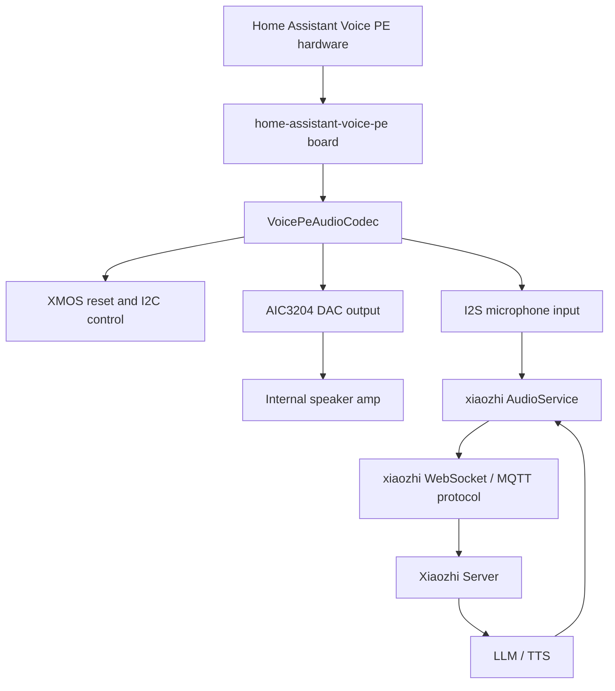

# Home Assistant Voice PE Xiaozhi Support Design

## Goal

让 Home Assistant Voice Preview Edition 刷入 xiaozhi-esp32 固件后，第一阶段能联网、连接小智 Server，并完成一次语音问答。

第一阶段不追求完整产品体验，只打通硬件最小链路：XMOS 控制、麦克风输入、AIC3204 播放输出、功放使能、小智会话。

## Confirmed Direction

| 方案 | 结论 | 原因 |
|---|---|---|
| 新增 xiaozhi 原生板卡 | 采用 | 符合 xiaozhi-esp32 架构，后续可独立构建和 OTA |
| 改 ESPHome WebSocket | 不采用 | 会被 ESPHome Voice Assistant 和 HA Assist 业务层绑住 |
| 只做临时探针固件 | 作为验证手段 | 可以暴露音频风险，但不是最终交付 |

## Architecture

## Hardware Facts

| Item | Value |
|---|---|
| SoC | ESP32-S3 |
| Flash | 16 MB |
| PSRAM | 8 MB |
| XMOS control I2C | SDA GPIO5, SCL GPIO6 |
| XMOS I2C address | 0x42 |
| XMOS reset | GPIO4 |
| Mic I2S | BCLK GPIO13, LRCLK GPIO14, DIN GPIO15 |
| Mic format | 16 kHz, 32-bit, stereo, secondary mode in ESPHome |
| Speaker I2S | BCLK GPIO8, LRCLK GPIO7, DOUT GPIO10 |
| Speaker format | 48 kHz, 32-bit, stereo, secondary mode in ESPHome |
| Audio DAC | TI AIC3204 |
| Internal speaker amp | GPIO47 |
| Center button | GPIO0 |
| Mute switch | GPIO3 |
| LED ring | GPIO21, 12 WS2812 LEDs |
| LED power | GPIO45 |
| Rotary encoder | GPIO16 / GPIO18 |
| Jack detect | GPIO17 |
| Grove I2C | SDA GPIO1, SCL GPIO2 |
| Grove power | GPIO46 |
| Partition table | Existing `partitions/v2/16m.csv` |
| WiFi provisioning | Existing `WifiBoard` / `esp-wifi-connect` |
| WiFi credential store | Existing `wifi` NVS namespace |

## First Stage Scope

| Included | Not Included |
|---|---|
| New board type `home-assistant-voice-pe` | LED animations |
| New `VoicePeAudioCodec` | Rotary volume UX |
| XMOS reset and version read | Headphone jack switching |
| Mic I2S read path | Grove support |
| AIC3204 init and speaker output | Device-side AEC |
| Internal speaker amp enable | Local wake word |
| Xiaozhi server one-turn voice test | XMOS DFU update flow |
| Existing WiFi/NVS config reuse | Voice PE specific NVS schema |

## Design Decisions

| Decision | Reason |
|---|---|
| Add `main/boards/home-assistant-voice-pe/` | Avoid reusing another board name and OTA identity |
| Use `BOARD_TYPE_HOME_ASSISTANT_VOICE_PE` | Matches existing Kconfig naming style |
| Start with `CONFIG_WAKE_WORD_DISABLED=y` | Manual/session test first, wake word later |
| Do not enable `CONFIG_USE_DEVICE_AEC` in stage one | The reference channel must be proven before AEC is valid |
| Add a dedicated `VoicePeAudioCodec` | Existing `NoAudioCodec` and `BoxAudioCodec` do not initialize XMOS/AIC3204 |
| Assume existing XMOS firmware is present | DFU is a separate risk and not needed for first hardware bring-up |
| Use one internal I2C instance for XMOS control and health check | GPIO5/6 is the official control path; separate buses would hide wiring mistakes |
| Reuse existing WiFi/NVS paths | Voice PE should behave like other `WifiBoard` boards in stage one |
| Keep resampling in `AudioService` | `VoicePeAudioCodec` declares real hardware rates: 16k input and 48k output |
| Convert mic 32-bit PCM by arithmetic right shift | First stage RMS and encoder input must use one deterministic int16 path |

## Initialization Order

| Step | Action |
|---|---|
| 1 | Initialize board GPIO and internal I2C GPIO5/6 |
| 2 | Reset XMOS with GPIO4 |
| 3 | Read XMOS health/version from I2C `0x42` on the same bus |
| 4 | Initialize AIC3204 and amp control |
| 5 | Initialize I2S RX/TX and `VoicePeAudioCodec` |
| 6 | Enter existing WiFi provisioning/connection flow |
| 7 | Connect to Xiaozhi Server and run one voice turn |

## Validation Flow

| Step | Validation |
|---|---|
| 1 | Build can select `home-assistant-voice-pe` |
| 2 | Boot log shows XMOS reset and I2C version read |
| 3 | int16 PCM RMS average while speaking 30cm from the device is at least 200 higher than silence |
| 4 | AIC3204 initializes and 1 kHz test tone plays |
| 5 | xiaozhi protocol connects to server |
| 6 | One voice question produces one TTS answer |

## Validation Result

| Step | 2026-05-16 Result |
|---|---|
| Build | ESP-IDF build passed for `home-assistant-voice-pe` |
| XMOS | Firmware `1.3.1` read over I2C `0x42` |
| Mic | `channel1=NS`, fixed 24x gain, speech RMS clearly above silence |
| Speaker | 1 kHz test tone audible from internal speaker |
| Network | WiFi connected and MQTT connected to Xiaozhi endpoint |
| Conversation | One button-triggered Xiaozhi conversation completed; user confirmed TTS reply |

## Risk

| Risk | First exposure |
|---|---|
| XMOS I2S timing differs from xiaozhi assumptions | Mic RMS experiment before full conversation |
| AIC3204 does not play without full register sequence | 1 kHz output test before TTS |
| AEC assumptions are wrong | Keep `input_reference=false` in stage one |
| Local wake word masks hardware issues | Keep wake word disabled in stage one |
| TTS sample rate mismatch | `AudioService` resamples decoded TTS to 48k before `VoicePeAudioCodec::Write` |
| XMOS boot timing varies | Poll version read after reset release until success or 4000ms timeout |

## Sources

| Source | Use |
|---|---|
| `https://www.home-assistant.io/voice-pe/` | Hardware specs |
| `https://github.com/esphome/home-assistant-voice-pe` | Official ESPHome firmware |
| `https://raw.githubusercontent.com/esphome/home-assistant-voice-pe/dev/home-assistant-voice.yaml` | GPIO and audio configuration |
| `https://github.com/esphome/home-assistant-voice-pe/tree/dev/esphome/components/voice_kit` | XMOS control protocol |
| `https://github.com/esphome/esphome/blob/35631be260c0fd6fae1e4c945f16790979ba777c/esphome/components/aic3204/aic3204.cpp` | AIC3204 initialization |
| `https://github.com/esphome/esphome/blob/35631be260c0fd6fae1e4c945f16790979ba777c/esphome/components/aic3204/aic3204.h` | AIC3204 definitions |
| `docs/custom-board.md` | xiaozhi board addition workflow |
