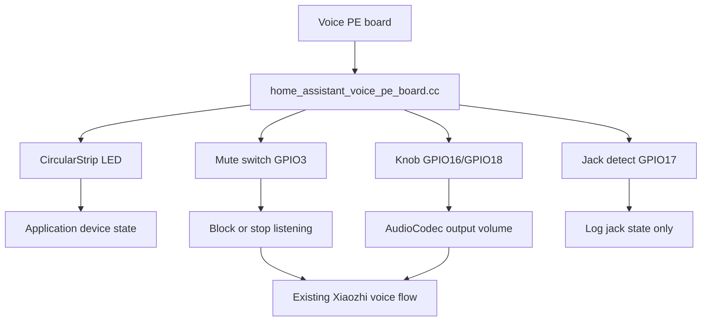

# Voice PE Interaction Feature Design

## Goal

第二阶段把 Home Assistant Voice PE 从“能完成一次小智问答”推进到“板载交互可用”。本阶段只接入不改变语音主链路的硬件交互：LED 状态环、物理 mute 开关、旋钮音量、耳机检测。

## Confirmed Scope

| 功能 | 结论 | 原因 |
|---|---|---|
| LED 状态环 | 纳入 005 | 复用现有 `CircularStrip`，能直接跟随设备状态 |
| Mute 开关 | 纳入 005 | Voice PE 核心隐私交互，必须能阻止继续收音 |
| 旋钮音量 | 纳入 005 | 复用现有 `Knob` 和 `AudioCodec::SetOutputVolume()` |
| 耳机检测 | 纳入 005 | 先记录插拔状态，为后续耳机/扬声器切换打基础 |
| 本地唤醒词 | 暂不纳入 | 会改变语音入口，先不影响已验证的一次问答 |
| AEC | 暂不纳入 | reference channel 尚未验证，不能假开 |
| Grove / 电源扩展 | 暂不纳入 | 不在语音交互主路径 |
| XMOS DFU | 暂不纳入 | 属于维护能力，不属于本阶段交互功能 |

## Architecture

## Hardware Mapping

| 功能 | 引脚/参数 |
|---|---|
| LED data | GPIO21 |
| LED power | GPIO45 |
| LED count | 12 WS2812 |
| Mute switch | GPIO3，active-high |
| Rotary encoder A/B | GPIO16 / GPIO18 |
| Jack detect | GPIO17 |

## Design Decisions

| 决策 | 说明 |
|---|---|
| LED 只做状态灯 | 不新增自定义灯效协议，不暴露远程控制 |
| LED 先复用现有颜色语义 | starting/connecting/listening/speaking 等状态由 `CircularStrip::OnStateChanged()` 处理 |
| Mute 是麦克风隐私静音 | 不是输出音量静音；mute 打开时不能开始新的听音 |
| Mute 打开时中断当前听音 | 如果设备正在 listening/connecting，切回 idle 或停止听音，不能继续上传麦克风 |
| Speaking 时打开 mute 不打断 TTS | mute 控制收音权限，不控制扬声器播放 |
| 旋钮只调输出音量 | 不调输入增益，不调 XMOS 增益，避免影响第一阶段麦克风实测口径 |
| 硬件回调用主任务调度 | mute/旋钮触发应用行为时，通过 `Application::Schedule()` 回到主任务执行 |
| 音量步进为 10 | 与现有实体音量键板卡保持一致 |
| 耳机检测只做状态日志 | 不切换输出路由，因为当前 AIC3204/耳机链路未验证 |
| 不新增 NVS schema | 音量继续走 `AudioCodec::SetOutputVolume()` 现有 `audio.output_volume` |

## User Flow

| 场景 | 行为 |
|---|---|
| 开机/联网/听音/播报 | LED 环跟随现有设备状态变化 |
| 用户打开 mute | 设备记录 muted，阻止新听音；如果正在听音则停止 |
| 小智正在 speaking 时打开 mute | 当前 TTS 继续播放，但后续不能进入听音 |
| 用户关闭 mute | 恢复按钮触发听音能力 |
| 用户旋转旋钮 | 每格音量 +/-10，限制在 0..100 |
| 用户插拔耳机 | 串口日志显示插入/拔出，不改变扬声器输出 |

## Error Handling

| 错误 | 行为 |
|---|---|
| LED power GPIO 配置失败 | `ESP_ERROR_CHECK` 暴露错误，不假装 LED 可用 |
| LED strip 初始化失败 | 构造失败直接暴露，不用 `NoLed` 掩盖 |
| Mute / jack GPIO 读不到稳定状态 | 日志暴露，暂停硬件验收 |
| 旋钮初始化失败 | 日志报错，音量功能验收失败 |

## Validation

| 功能 | 验证 |
|---|---|
| LED | 开机、联网、单击进入听音、小智说话时肉眼看到灯色变化 |
| Mute | mute 打开后单击按钮不会进入 listening；正在 listening 时打开 mute 会停止 |
| 旋钮 | 串口看到音量变化；播放测试音或 TTS 的主观音量变化 |
| 耳机检测 | 插拔耳机时串口日志状态变化 |
| 回归 | 小智一次语音问答仍成功 |

## Risk

| 风险 | 控制 |
|---|---|
| Mute 开关电平方向未知 | 实施时先打印 raw GPIO 状态，再按实测固定 active level |
| 耳机检测电平方向 | 硬件实测未插入为 raw=0，按 active-high 判断插入；只做日志验证，不做音频切换 |
| LED 电源 GPIO 极性未知 | 先按官方 GPIO45 enable 输出高电平；失败则暂停并更新 spec |
| 旋钮方向可能反 | 以实测为准，反向则只改 GPIO/方向映射，不改音量逻辑 |
| 12 颗 LED 全亮可能增加 USB 供电压力 | 先用 `CircularStrip` 低亮度默认值；如供电不稳，只降低亮度，不改变状态语义 |
