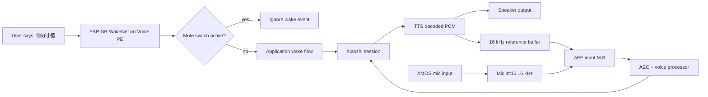

# 006 Design：Voice PE 本地唤醒词与 AEC

## 决策

| 项 | 决策 | 原因 |
|---|---|---|
| 唤醒词 | 固定“你好小智” | ESP-SR 已内置模型，不需要训练 |
| 唤醒实现 | `CONFIG_USE_AFE_WAKE_WORD` | Voice PE 是 ESP32-S3 + PSRAM，适合走 AFE WakeNet |
| 输入通道 | 唤醒和 STT 先走 XMOS channel 1 / NS | 004 已有主观背景噪声，006 需要用 raw mic RMS 和 AFE output RMS 判断是输入增益/硬件噪声还是 AFE/AEC 放大 |
| 自定义唤醒词 | 不做 | 会引入 Multinet 阈值和误唤醒调参 |
| AEC | 设备端 AEC | 用户要解决本机播放回声，先做本地闭环 |
| AEC reference | 来自实际 speaker PCM | AEC 的第一性原理是用播放参考抵消麦克风中的回声 |
| 启用门槛 | 先证明 reference，再启用 AEC | 没有 reference 的 AEC 是假功能 |

## 全局流程

## 音频结构

| 数据 | 采样率 | 说明 |
|---|---:|---|
| mic 输入 | 16 kHz | 唤醒和语音上传先使用 XMOS channel 1 / NS；int16 转换保持 004 口径，并记录 raw/output RMS 做噪声分层 |
| speaker 输出 | 48 kHz | 继续使用 004 的 AIC3204/I2S TX |
| AEC reference | 16 kHz | 从 speaker PCM 经 ESP audio resampler 转换得到，播放写入后立即进入 reference FIFO |
| AFE 输入 | 16 kHz, 2ch | interleaved `mic,reference` |

## 风险

| 风险 | 影响 | 控制方式 |
|---|---|---|
| WakeNet 模型没被打进固件 | 无法本地唤醒 | 构建和启动日志检查“你好小智”模型 |
| reference 与实际播放不同步 | AEC 效果差 | 对齐官方小智软件 reference 实现，不额外增加 100ms 延迟；超过 300ms 无新播放 PCM 时清空旧 reference；再按实机回声识别结果微调 |
| reference 播放时为 0 | 假 AEC | 阻塞验收，不能继续宣称完成 |
| AFE 仍是单通道 | AEC 实际无效 | 日志和静态测试必须证明 `M,R` |
| speaking 后立即听到自己 | 把 TTS 尾音当用户语音 | TTS stop 先 drain playback，再切 listening；等待 active playback 结束，并在 Voice PE reference 设备上保留 700ms 尾音窗口 |
| AFE `FEED` ringbuffer 满 | fetch 线程被上行编码队列反压，导致输入丢失 | voice processor 输出入队不能阻塞 AFE fetch；队列满时丢弃过期上行帧、保留最新帧 |
| speaking 阶段仍有回声 ASR | 软件 reference AEC 残留、AFE 内部缓存或已排队的上行帧被服务器识别成用户语音 | Voice PE 当前使用 auto 收音模式，speaking 阶段不运行服务器上传链路；自由边播边听等 reference 延迟实测或硬件回采证明可靠后再启用 |
| 唤醒后进 listening 但没听到回复 | TTS 音频/文本迟到，状态已切 listening 后音频包被丢弃 | listening 状态也接收服务器 TTS 音频；只要本地仍有播放工作或 700ms 尾音保护窗未结束，就暂停麦克风上传 |
| TTS 只播一个字或被截断 | 音频包先于 `tts start` JSON 到达，进入 speaking 时清空了已排队音频 | speaking 状态入口不清 decode/playback queue；播放队列只在收音入口或明确停止路径清理 |
| 偶发少播后半句 | `listening` 入口启用 voice processing 时隐式清空播放队列，刚接收的迟到 TTS 被清掉 | `EnableVoiceProcessing(true)` 只启动收音处理，不清 decode/playback queue |
| 多段回复或工具结果被截断 | 从 TTS stop 回到 `listening` 时重复发送 `listen/start`，打断服务器仍在输出的后续回复 | 遵循官方小智 realtime 连续流语义；processor 已运行时不重复重置流、不清空上行队列、不重新发送 `listen/start` |
| 安静时 RMS 仍接近满幅 | 可能是原始输入噪声/增益，也可能是 AFE/AEC 放大 | 同一条 pipeline 日志必须同时输出 `raw_rms` 和 `out_rms`；先定位层级再改增益或 AFE |
| 小智回复出声时有电流声 | 可能是数字削波，也可能是 AIC3204/功放模拟输出失真 | 播放期间记录 output peak/RMS/volume；先按 peak 判断是否削波，再动音量映射或驱动增益 |
| mute 绕过 | 隐私风险 | mute 打开时应用层拒绝本地唤醒 |
| 误唤醒增加 | 用户体验差 | 第一版只启用一个预置词，不启用多个模型 |
| 唤醒后 AEC 未就绪 | 播放中唤醒瞬间可能有回声窗口 | 唤醒前先证明 reference buffer 和 AFE `M,R` 已初始化；硬件验收包含纯播放无人说话 30 秒 |
| PSRAM 占用过高 | WakeNet + AFE + reference buffer 可能导致运行不稳 | Task 0 和硬件回归记录 free PSRAM |

## 用户流程

| 场景 | 预期 |
|---|---|
| 正常唤醒 | 用户说“你好小智”，设备进入 listening，小智回复 |
| mute 打开 | 用户说“你好小智”，设备不听音 |
| 小智播报中 | AEC 使用播放 reference 抑制扬声器回声；Voice PE 当前不运行 speaking 阶段服务器上传链路 |
| 播报结束 | 当前播放 chunk 写完、迟到音频包处理完并经过 700ms 尾音窗口后，才允许 listening 上传用户语音；若仍有播放工作或尾音保护窗未结束，继续暂停麦克风上传 |
| 按钮使用 | 中间按钮仍能触发 004/005 的问答流程 |
| 音量调整 | 旋钮调节音量后，reference 仍来自实际播放 PCM |

## 不做

| 项 | 原因 |
|---|---|
| Grove / 电源扩展 | 与本地唤醒和 AEC 无关 |
| XMOS DFU | 高风险维护能力，不能混入音频功能 |
| 自定义唤醒词 | 预置“你好小智”已满足目标 |
| 耳机路由 | 需要单独验证 AIC3204 路由 |
| 协议改造 | 现有小智唤醒流程已可复用 |
