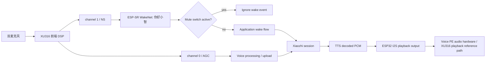

# 006 Design：Voice PE 本地唤醒词与 XU316 前端 DSP

## 决策

| 项 | 决策 | 原因 |
|---|---|---|
| 唤醒词 | 固定“你好小智” | ESP-SR 已内置模型，不需要训练。 |
| 唤醒实现 | `CONFIG_USE_AFE_WAKE_WORD` | Voice PE 是 ESP32-S3 + PSRAM，适合复用现有 AFE WakeNet 流程。 |
| 输入通道 | 唤醒走 XMOS channel 1 / NS，STT/语音上传走 XMOS channel 0 / AGC | 对齐官方 ESPHome：`micro_wake_word.channels: 1`，`voice_assistant.channels: 0`。 |
| 自定义唤醒词 | 不做 | 会引入 Multinet 阈值和误唤醒调参。 |
| 前端 DSP | XU316 负责 AEC、NS、AGC、远场拾音前处理 | Voice PE 官方结构就是 XU316 做麦克风前端，ESP32 不应重复做 device AEC。 |
| ESP32 职责 | 联网、唤醒/对话状态机、音频上传、TTS 播放、HA、LED、按键、设备状态 | 这些是小智协议和设备控制职责，和麦克风前端 DSP 分开。 |
| ESP32 AEC | 不启用 `CONFIG_USE_DEVICE_AEC` / `CONFIG_USE_SERVER_AEC` | 启用 ESP32 AEC 会让职责和官方 Voice PE 设计冲突，也会叠加处理 XU316 已处理过的音频。 |
| 播放参考 | TTS/提示音继续走官方播放路径，验证 XU316 能获得播放参考 | AEC 的第一性原理是用真实播放参考抵消回声；若无法证明 XU316 reference path，不能宣称 XU316 AEC 完成。 |
| 启用门槛 | 先证明 XU316 初始化和 stage，再验收回声效果 | 没有 XU316 stage 证据时，后面的回声判断没有定位价值。 |

## 全局流程

## 音频结构

| 数据 | 采样率 | 说明 |
|---|---:|---|
| wake mic 输入 | 16 kHz | 使用 XU316 channel 1 / NS；int16 转换保持 004 口径。 |
| voice mic 输入 | 16 kHz | 使用 XU316 channel 0 / AGC；这是上传给小智 STT/LLM 的主链路。 |
| speaker 输出 | 48 kHz | 继续使用 004 的 AIC3204/I2S TX；TTS/提示音都从这里播放。 |
| XU316 playback reference | 硬件路径决定 | 必须通过实机日志/回声结果证明 XU316 能用 ESP32 播放输出作为参考；不能用 ESP32 软件 FIFO 替代。 |
| ESP32 主上传输入 | 16 kHz, 1ch | XU316 处理后的单路 mic；不是 ESP32 AFE `M,R`。 |
| ESP32 full-duplex | 播放和采集并行 | `duplex_` 保持 true，但不等于 `input_reference_=true`。 |

## 风险

| 风险 | 影响 | 控制方式 |
|---|---|---|
| WakeNet 模型没被打进固件 | 无法本地唤醒 | 构建和启动日志检查“你好小智”模型。 |
| XU316 初始化失败 | 前端 DSP 不可用 | 启动日志必须显示 XU316 初始化成功和版本/状态。 |
| XU316 stage 未写入 | channel 0/1 职责不可信 | 静态测试和启动日志必须证明 channel 0 = AGC、channel 1 = NS。 |
| ESP32 仍启用 device/server AEC | 职责重复，音频被二次处理 | 静态测试禁止 `CONFIG_USE_DEVICE_AEC`、`CONFIG_USE_SERVER_AEC`。 |
| ESP32 主链路仍输出 `M,R` | 仍在走 ESP32 AFE AEC 架构 | 静态测试要求 `input_reference_=false`、`input_channels_=1` 或等价实现。 |
| `duplex_` 被误关 | TTS 播放期间无法保持必要采集/打断路径 | 将 `duplex_` 和 `input_reference_` 解耦，测试要求 `duplex_=true`。 |
| XU316 playback reference path 无法证明 | 不能确认 XU316 AEC 生效 | 暂停并更新 Spec；不能用 ESP32 reference FIFO 代替。 |
| 唤醒和语音继续共用同一 slot | 偏离官方 Voice PE 设计，AGC/NS 职责混淆 | 静态测试证明 `kWakeWordMicSlot = 1`、`kVoiceMicSlot = 0`，硬件日志能看到用途切换。 |
| 32-bit mic 转 int16 缩放错误 | 安静环境 raw/out RMS 接近满幅，STT 输入削顶 | 对齐 ESPHome Q31 口径：右移 16 位转 Q15；wake 再乘官方 `gain_factor: 4`，voice 保持 1:1。 |
| AGC 通道噪声偏高 | 语音上传质量可能下降 | 语音上传先对齐官方 `volume_multiplier: 1`，不套用唤醒增益；再用 raw/output RMS 和削顶比例定位。 |
| speaking 后立即听到自己 | 把 TTS 尾音当用户语音 | TTS stop 先 drain playback，再切 listening；等待 active playback 结束，并保留 `kPlaybackTailGuardMs = 200ms` 尾音窗口。 |
| AFE `FEED` ringbuffer 满 | fetch 线程被上行编码队列反压，导致输入丢失 | voice processor 输出入队不能阻塞 AFE fetch；队列满时丢弃过期上行帧、保留最新帧。 |
| speaking 阶段仍有回声 ASR | 播放尾音、XU316 reference path 或已排队上行帧被服务器识别成用户语音 | Voice PE 当前使用 auto 收音模式，speaking 阶段不运行服务器上传链路；自由边播边听等 XU316 reference path 实测可靠后再启用。 |
| 唤醒后进 listening 但没听到回复 | TTS 音频/文本迟到，状态已切 listening 后音频包被丢弃 | listening 状态也接收服务器 TTS 音频；只要本地仍有播放工作或 playback tail guard 未结束，就暂停麦克风上传。 |
| TTS 只播一个字或被截断 | 音频包先于 `tts start` JSON 到达，进入 speaking 时清空了已排队音频 | speaking 状态入口不清 decode/playback queue；播放队列只在收音入口或明确停止路径清理。 |
| 偶发少播后半句 | `listening` 入口启用 voice processing 时隐式清空播放队列，刚接收的迟到 TTS 被清掉 | `EnableVoiceProcessing(true)` 只启动收音处理，不清 decode/playback queue。 |
| 多段回复或工具结果被截断 | 从 TTS stop 回到 `listening` 时重复发送 `listen/start`，打断服务器仍在输出的后续回复 | 遵循官方小智 realtime 连续流语义；processor 已运行时不重复重置流、不清空上行队列、不重新发送 `listen/start`。 |
| 安静时 RMS 仍接近满幅 | 可能是原始输入噪声/增益，也可能是 XU316/AFE 放大 | 同一条 pipeline 日志必须同时输出 `raw_rms` 和 `out_rms`；先定位层级再改增益或 AFE。 |
| 小智回复出声时有电流声 | 可能是数字削波，也可能是 AIC3204/功放模拟输出失真 | 播放期间记录 output peak/RMS/volume；先按 peak 判断是否削波，再动音量映射或驱动增益。 |
| mute 绕过 | 隐私风险 | mute 打开时应用层拒绝本地唤醒。 |
| 误唤醒增加 | 用户体验差 | 第一版只启用一个预置词，不启用多个模型。 |
| PSRAM 占用过高 | WakeNet + AFE 可能导致运行不稳 | Task 0 和硬件回归记录 free PSRAM。 |

## 用户流程

| 场景 | 预期 |
|---|---|
| 正常唤醒 | 用户说“你好小智”，设备进入 listening，小智回复。 |
| 唤醒阶段 | ESP32 读取 XU316 channel 1 / NS 给 WakeNet。 |
| 语音上传阶段 | 唤醒后 ESP32 切到 XU316 channel 0 / AGC，上传给小智协议。 |
| mute 打开 | 用户说“你好小智”，设备不听音。 |
| 小智播报中 | TTS/提示音从 ESP32 播放输出；XU316 负责前端回声处理；Voice PE 当前不运行 speaking 阶段服务器上传链路。 |
| 播报结束 | 当前播放 chunk 写完、迟到音频包处理完并经过 `kPlaybackTailGuardMs = 200ms` 尾音窗口后，才允许 listening 上传用户语音；若仍有播放工作或尾音保护窗未结束，继续暂停麦克风上传。 |
| 按钮使用 | 中间按钮仍能触发 004/005 的问答流程。 |
| 音量调整 | 旋钮调节音量后，播放输出仍走同一路径，便于 XU316 使用真实播放参考。 |

## 不做

| 项 | 原因 |
|---|---|
| Grove / 电源扩展 | 与本地唤醒和 XU316 前端 DSP 分工无关。 |
| XMOS DFU | 高风险维护能力，不能混入音频功能。 |
| 自定义唤醒词 | 预置“你好小智”已满足目标。 |
| 耳机路由 | 需要单独验证 AIC3204 路由。 |
| 协议改造 | 现有小智唤醒流程已可复用。 |
| ESP32 device AEC / server AEC | Voice PE 目标分工是 XU316 做 AEC/NS/AGC/远场前处理。 |
| ESP32 二次 NS/AGC | 会叠加处理 XU316 已处理过的音频，定位困难。 |
| 经验性输入增益调参 | 语音上传只做官方 1:1 增益对齐，不继续按主观听感叠加后处理增益。 |
| XU316 pipeline 自定义调参 | 官方默认就是 channel 0 = AGC、channel 1 = NS，本 feature 只对齐和验证，不调内部 stage 参数。 |
