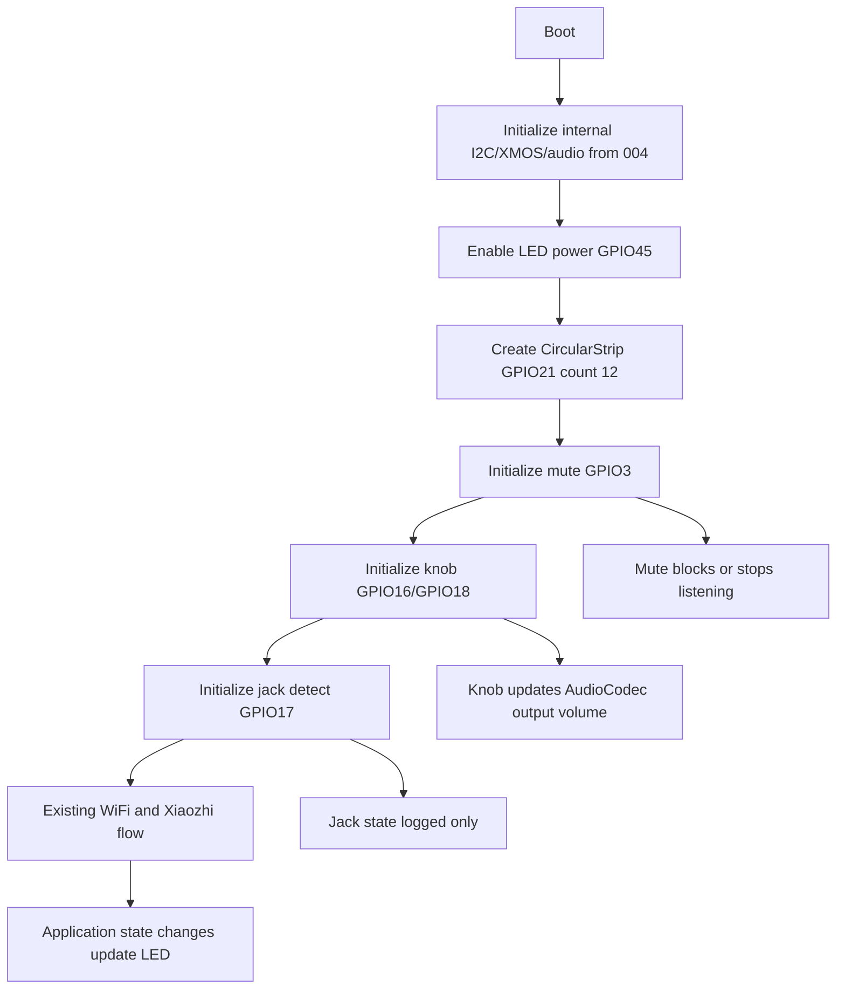

# 005 Spec：Voice PE 板载交互功能

## 目标

在 `home-assistant-voice-pe` 板卡上接入 LED 状态环、物理 mute 开关、旋钮音量和耳机检测，提升真实设备交互体验，同时保持 004 阶段已跑通的小智语音问答链路不变。

## 代码证据

| 文件/来源 | 证据 |
|---|---|
| `main/boards/home-assistant-voice-pe/config.h` | 已定义音频、XMOS、中间按钮和功放 GPIO；005 需要补 LED/mute/encoder/jack GPIO。 |
| `main/boards/home-assistant-voice-pe/home_assistant_voice_pe_board.cc` | 当前只初始化 I2C、XMOS 和中间按钮；005 的板载交互应集中在此板卡文件。 |
| `main/led/circular_strip.h/.cc` | 已实现 WS2812 ring，并通过 `OnStateChanged()` 映射 xiaozhi 设备状态。 |
| `main/application.cc` | 状态变化时会调用 `Board::GetLed()->OnStateChanged()`。 |
| `main/boards/common/knob.h/.cc` | 已封装 `iot_knob`，支持 `OnRotate(bool clockwise)`。 |
| `main/audio/audio_codec.cc` | `SetOutputVolume()` 已写入 `audio.output_volume`，可复用现有持久化。 |
| `main/boards/waveshare/esp32-s3-lcd-0.85/esp32-s3-lcd-0.85.cc` | 可参考 `CircularStrip` 初始化和实体音量控制写法。 |
| `specs/004-spec-home-assistant-voice-pe.md` | 已记录 Voice PE LED、mute、encoder、jack GPIO 真值。 |

## 总体流程

## 硬件映射

| 功能 | 配置名 | 值 |
|---|---|---|
| LED data | `VOICE_PE_LED_DATA_GPIO` | GPIO21 |
| LED power | `VOICE_PE_LED_POWER_GPIO` | GPIO45 |
| LED count | `VOICE_PE_LED_COUNT` | 12 |
| Mute switch | `VOICE_PE_MUTE_GPIO` | GPIO3 |
| Mute active level | `VOICE_PE_MUTE_ACTIVE_LEVEL` | 1，ESPHome 官方 GPIO3 未配置 inverted；当前启动态 raw=0 应为未静音 |
| Encoder A | `VOICE_PE_ENCODER_A_GPIO` | GPIO16 |
| Encoder B | `VOICE_PE_ENCODER_B_GPIO` | GPIO18 |
| Jack detect | `VOICE_PE_JACK_DETECT_GPIO` | GPIO17 |
| Jack inserted level | `VOICE_PE_JACK_INSERTED_LEVEL` | 1，硬件实测未插入为 raw=0 |
| Volume step | `VOICE_PE_VOLUME_STEP` | 10 |

## LED 状态环

| 项 | 设计 |
|---|---|
| 初始化位置 | `HomeAssistantVoicePeBoard::InitializeLed()` |
| 初始化顺序 | `InitializeInternalI2c()` 和 `InitializeXmos()` 成功后、按钮回调注册前 |
| 供电 | 配置 GPIO45 为 output，启动时拉高 |
| 数据 | `new CircularStrip(VOICE_PE_LED_DATA_GPIO, VOICE_PE_LED_COUNT)` |
| 亮度 | 先使用 `CircularStrip` 默认低亮度；如 USB 供电不稳，只降低亮度，不改变状态语义 |
| 状态更新 | override `GetLed()` 返回 `led_strip_` |
| 行为 | 复用 `CircularStrip::OnStateChanged()`，不新增自定义状态机 |

## Mute 开关

| 项 | 设计 |
|---|---|
| 初始化位置 | `InitializeMuteSwitch()` |
| GPIO 模式 | input pull-up，按 active-high 读取；实测若相反只改 `VOICE_PE_MUTE_ACTIVE_LEVEL` |
| 状态字段 | `bool muted_`，保存当前物理开关状态 |
| 触发方式 | 使用 50ms `esp_timer` 轮询，不用 GPIO 中断 |
| debounce | 连续两个采样周期状态一致才接受状态变化，即约 100ms 稳定后生效 |
| 线程要求 | 轮询回调只读 GPIO 和判断状态；涉及 `Application` 状态变更时必须用 `Application::Schedule()` 回到主任务 |
| 打开 mute | 记录日志；阻止中间按钮开始新听音 |
| listening/connecting 中打开 mute | 调用现有 `Application::StopListening()` 或等价主线程调度，回到 idle/安全状态 |
| speaking 中打开 mute | 不调用 `AbortSpeaking()`，不停止当前 TTS；TTS 结束后仍按 muted 状态阻止新听音 |
| 关闭 mute | 记录日志；恢复中间按钮听音能力 |
| 禁止行为 | 不把输出音量设为 0，不改输入增益，不上传静音假音频 |

Mute 的第一性原理是“物理隐私开关”。因此它控制“是否允许收音”，不是控制“喇叭是否出声”。

## 旋钮音量

| 项 | 设计 |
|---|---|
| 初始化位置 | `InitializeKnob()` |
| 复用类 | `Knob` from `main/boards/common/knob.*` |
| 方向 | `clockwise=true` 加音量；如实机反向，修正方向映射 |
| 步进 | 每格 10 |
| 范围 | clamp 到 0..100 |
| 更新入口 | `Knob::OnRotate()` 回调只计算方向；实际 `GetAudioCodec()->SetOutputVolume(volume)` 必须通过 `Application::Schedule()` 在主任务执行 |
| 持久化 | 复用 `AudioCodec` 现有 `audio.output_volume` |
| 日志 | 打印新音量，Voice PE 无屏，不显示 notification |

旋钮不改变麦克风输入增益，避免污染 004 阶段确定的 24 倍固定增益和 RMS 口径。

## 耳机检测

| 项 | 设计 |
|---|---|
| 初始化位置 | `InitializeJackDetect()` |
| GPIO 模式 | input pull-up，硬件实测按 active-high 读取；未插入为 raw=0 |
| 行为 | 插入/拔出时只打印日志 |
| 不做 | 不切换 AIC3204 路由，不关闭内置扬声器 |

耳机检测本阶段只证明 GPIO 真实可用。音频路由切换需要重新验证 AIC3204 输出路径，不能混进 005。

## 错误处理

| 错误 | 行为 |
|---|---|
| LED power 配置失败 | `ESP_ERROR_CHECK` 暴露，启动失败比假成功更好 |
| `CircularStrip` 初始化失败 | 暴露错误，不回退 `NoLed` |
| `Knob` 创建失败 | 记录错误，旋钮验收失败 |
| mute/jack 电平不符合实测 | 暂停验收，更新 spec 的 active level 后再继续 |
| GPIO 轮询异常 | 记录错误；不得静默认为未 mute 或未插耳机 |
| 非主任务硬件回调触发应用逻辑 | 不直接写 NVS 或改应用状态，必须改为主任务调度 |

## 验证策略

| 层 | 验证 |
|---|---|
| 静态检查 | `rg -n "VOICE_PE_LED|VOICE_PE_MUTE|VOICE_PE_ENCODER|VOICE_PE_JACK|CircularStrip|Knob" main/boards/home-assistant-voice-pe main/boards/common` |
| 构建 | `python scripts/release.py home-assistant-voice-pe` |
| LED 硬件 | 重启后观察状态灯；单击进入 listening；小智回复进入 speaking |
| Mute 硬件 | mute 打开后单击按钮不进入 listening；listening/connecting 中打开 mute 会停止；speaking 中打开 mute 不停止 TTS |
| 旋钮硬件 | 旋转时日志显示音量 0..100，测试音/TTS 音量变化 |
| Jack 硬件 | 插拔耳机时日志变化 |
| 回归 | 小智一次语音问答成功 |

## 需求追踪

| 需求 | Spec 章节 | 实施任务 | 验证 |
|---|---|---|---|
| REQ-1 | LED 状态环 | Task 2 | AC-1 |
| REQ-2 | LED 状态环 | Task 2 | AC-1 |
| REQ-3 | 错误处理 | Task 2/7 | review |
| REQ-4 | Mute 开关 | Task 3a | AC-2 |
| REQ-5 | Mute 开关 | Task 3b | AC-2 |
| REQ-6 | Mute 开关 | Task 3b | AC-3/AC-4 |
| REQ-7 | Mute 开关 | Task 3b/7 | review |
| REQ-8 | 旋钮音量 | Task 4 | AC-5 |
| REQ-9 | 旋钮音量 | Task 4 | AC-5/AC-6 |
| REQ-10 | 旋钮音量 | Task 4/7 | review |
| REQ-11 | 耳机检测 | Task 5 | AC-7 |
| REQ-12 | 耳机检测 | Task 5/7 | review |
| REQ-13 | 非目标 | Task 7 | config check |
| REQ-14 | 非目标 | Task 7 | config/code check |
| REQ-15 | 验证策略 | Task 6 | AC-8 |
