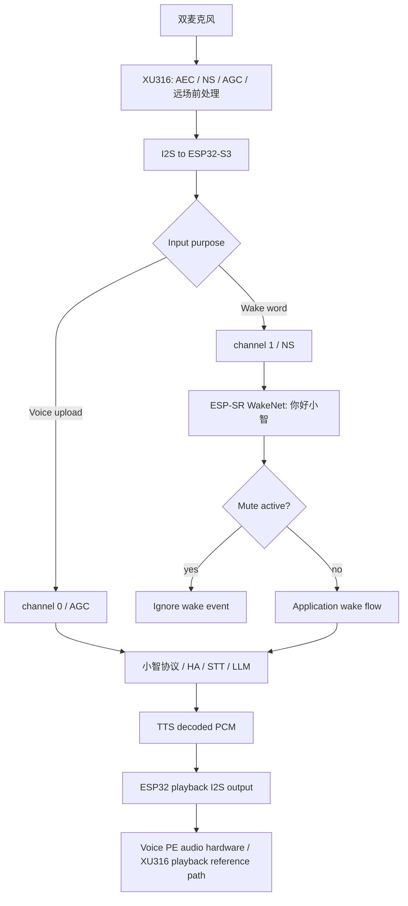

# 006 Spec：Voice PE 本地唤醒词与 XU316 前端 DSP

## 目标

让 `home-assistant-voice-pe` 支持本地说“你好小智”唤醒，并对齐官方 Voice PE 音频分工：XU316 负责 AEC 回声消除、NS 噪声抑制、AGC 自动增益和远场拾音前处理；ESP32-xiaozhi 负责联网、唤醒/对话状态机、音频上传、TTS 播放、HA 控制、LED、按键和设备状态。

006 必须对齐官方 ESPHome channel 用法：唤醒走 XMOS channel 1 / NS，语音处理和上传走 XMOS channel 0 / AGC。006 不做 ESP32 device AEC、不做 server AEC、不做二次 NS/AGC、不做自定义唤醒词、不做 XMOS DFU、不改小智协议。

## 代码证据

| 文件/来源 | 证据 |
|---|---|
| `main/boards/home-assistant-voice-pe/config.json` | Voice PE 已启用 `CONFIG_USE_AFE_WAKE_WORD`、`CONFIG_SR_WN_WN9_NIHAOXIAOZHI_TTS`、`CONFIG_SEND_WAKE_WORD_DATA`；不得启用 `CONFIG_USE_DEVICE_AEC`，不能让 ESP32 和 XU316 重复做前端 DSP。 |
| `managed_components/espressif__esp-sr/model/wakenet_model/*/_MODEL_INFO_` | 仓库已包含“你好小智” WakeNet 模型。 |
| `managed_components/espressif__esp-sr/Kconfig.projbuild` | 存在 `CONFIG_SR_WN_WN9_NIHAOXIAOZHI_TTS` 和 `CONFIG_SR_WN_WN9S_NIHAOXIAOZHI`。 |
| `main/Kconfig.projbuild` | ESP32-S3 + PSRAM 默认支持 `CONFIG_USE_AFE_WAKE_WORD`。 |
| `main/audio/wake_words/afe_wake_word.cc` | AFE wake word 会枚举模型并通过 `wake_word_detected_callback_` 进入应用唤醒流程。 |
| `main/audio/audio_service.cc` | `EnableWakeWordDetection()`、`SetModelsList()`、`PopWakeWordPacket()` 已有唤醒词数据流。 |
| `main/audio/processors/afe_audio_processor.cc` | 该路径可按 `CONFIG_USE_DEVICE_AEC`、`CONFIG_USE_SERVER_AEC` 和 `codec_->input_reference()` 组 AFE 输入；Voice PE 目标实现必须避免在主语音上传链路启用 ESP32 AEC/NS/AGC 叠加处理。 |
| `main/boards/common/board.h` | 当前没有麦克风静音查询接口；006 需要新增默认 false 的 `IsMicrophoneMuted()`，由 Voice PE override。 |
| `main/boards/home-assistant-voice-pe/voice_pe_audio_codec.cc` | 当前 `input_reference_` 和 `input_channels_` 按 `AUDIO_INPUT_REFERENCE` 输出 mic + reference，且 `kVoiceMicSlot` 仍未对齐官方 channel 0；目标实现要保留 full-duplex，但主上传输入改为 XU316 处理后的单路 mic。 |
| 官方 ESPHome `home-assistant-voice.yaml` | `micro_wake_word` 使用 `channels: 1` 和 `gain_factor: 4`，`voice_assistant` 使用 `channels: 0`、`noise_suppression_level: 0`、`auto_gain: 0 dbfs`、`volume_multiplier: 1`；这是 Voice PE 官方 channel 分工和语音上传增益边界。 |
| 官方 ESPHome `voice_kit` 组件 | 默认 `channel_0_stage=AGC`、`channel_1_stage=NS`，并在 XU316 初始化后写入 pipeline stage。 |
| `specs/004-*` | 004 固定了 16 kHz mic 输入和 48 kHz speaker 输出；006 对齐官方实现后，32-bit mic 输入按 Q31 -> Q15 右移 16 位转成 int16，语音上传通道不得继续套用唤醒通道增益。 |
| `specs/005-*` | 005 固定了 mute 是麦克风隐私开关，mute 打开时必须阻止听音入口。 |

## 总体流程

## XMOS channel 分工

| 用途 | ESP32 读取 slot | XU316 stage | 说明 |
|---|---:|---|---|
| 本地唤醒 | 1 | NS | 对齐官方 `micro_wake_word.channels: 1`，优先降低环境噪声和误唤醒。 |
| 语音处理/上传 | 0 | AGC | 对齐官方 `voice_assistant.channels: 0`，把送给小智 STT/LLM 的语音切到 AGC 通道。 |
| 音频测试 | 0 | AGC | 默认跟随语音处理路径，便于测试“实际上传给小智”的同一路音频。 |

实现上必须保留 `SetInputPurpose()` 作为唯一切换入口：`AudioInputPurpose::kWakeWord` 选择 slot 1，`AudioInputPurpose::kVoiceProcessing` 和 `AudioInputPurpose::kAudioTesting` 选择 slot 0。不要在 `Read()` 内根据设备状态临时猜用途。

## 本地唤醒词

| 项 | 设计 |
|---|---|
| 唤醒词 | 固定“你好小智” |
| 模型来源 | ESP-SR 预置 WakeNet，不训练自定义模型 |
| 配置 | 移除 `CONFIG_WAKE_WORD_DISABLED=y`，启用 `CONFIG_USE_AFE_WAKE_WORD=y` 和 `CONFIG_SR_WN_WN9_NIHAOXIAOZHI_TTS=y` |
| 唤醒数据 | 保持 `CONFIG_SEND_WAKE_WORD_DATA=y`，复用现有唤醒词音频发送路径 |
| 应用入口 | 复用 `Application::HandleWakeWordDetectedEvent()` 和 `ContinueWakeWordInvoke()` |
| mute 互斥 | 新增 `Board::IsMicrophoneMuted()` 默认 false，Voice PE 返回物理 mute 状态；`Application::HandleWakeWordDetectedEvent()` 进入唤醒流程前必须检查，muted 时关闭 wake detection 并直接返回 |
| mute 检测任务 | Voice PE mute 打开时在主任务停止 wake word detection；mute 关闭且设备处于 idle/speaking 时恢复 wake word detection；Application 门禁作为最终保护 |
| 自定义词 | 不启用 `CONFIG_USE_CUSTOM_WAKE_WORD`，不使用 `CONFIG_CUSTOM_WAKE_WORD` |
| 误唤醒处理 | 第一版不做阈值调参；硬件测试若出现每小时超过 3 次误唤醒，记录模型、状态和环境噪声，暂停并评估配置 |

## XU316 前端 DSP 设计

| 项 | 设计 |
|---|---|
| 前端职责 | XU316 负责 AEC、NS、AGC、远场拾音前处理。 |
| ESP32 职责 | ESP32 负责初始化 XU316、选择用途对应 channel、接收处理后的 I2S 音频、上传语音、播放 TTS、维护状态机和设备控制。 |
| XU316 pipeline | 初始化后必须写入官方分工：channel 0 = AGC，channel 1 = NS。 |
| mic 来源 | 唤醒使用 XMOS channel 1 / NS；语音处理、语音上传和 audio testing 使用 XMOS channel 0 / AGC。 |
| ESP32 输入格式 | 主语音上传链路使用 XU316 处理后的单路 mic；不能为 ESP32 AFE AEC 输出 interleaved `mic,reference`。 |
| full-duplex | 保留同时播放和采集能力；`duplex_` 不能再被 `input_reference_` 绑死。目标是 `duplex_=true`、`input_reference_=false`、`input_channels_=1` 或等价实现。 |
| ESP32 AEC/NS/AGC | Voice PE 主链路不得启用 `CONFIG_USE_DEVICE_AEC`、`CONFIG_USE_SERVER_AEC`，不得在 XU316 后叠加第二套 NS/AGC。 |
| TTS playback reference | ESP32 必须继续通过官方播放路径输出 TTS/提示音 PCM，让 Voice PE 音频硬件/XU316 能获得播放参考。若无法证明 XU316 可使用该路径作为回声参考，必须暂停并更新 Spec，不能宣称 XU316 AEC 完成。 |
| 转换和增益 | 32-bit I2S mic sample 按 Q31 -> Q15 右移 16 位转成 int16；唤醒 slot 使用官方 `gain_factor: 4`，语音上传 slot 0 对齐官方 `volume_multiplier: 1`，不得额外放大。若 AGC 通道实测噪声偏高，只记录 raw/out RMS 和削顶比例，不做经验性后处理调参。 |
| speaking 上行策略 | Voice PE 在 `speaking` 阶段不运行服务器上传链路；TTS 播放收尾后、切回 `listening` 前，必须重置本地 voice processor/AFe 缓冲，并清理上行 encode queue 和 send queue 中的残留语音帧。当前阶段默认 `auto` 收音模式，只保留本地唤醒词或中心按钮打断。自由边播边听必须等 XU316 playback reference 路径实测可靠后再启用。 |
| 实时上行反压 | AFE fetch 线程不能被 Opus 上行队列阻塞。编码队列满时丢弃过期上行帧并保留最新帧，避免 AFE `FEED` ringbuffer 爆满。 |
| 服务器收音重臂 | 普通板卡遵循官方小智 realtime 连续流语义：只有新开收音窗口、播放提示音入口或本地 voice processor 未运行时才发送 `listen/start` 并启动 voice processor；Voice PE 当前使用 `auto` 模式，避免 speaking 阶段连续上行造成重复 ASR。 |
| PSRAM | Task 0 和硬件启动日志必须记录 free PSRAM；WakeNet + AFE 后 PSRAM 异常下降时暂停。 |

## TTS 播放可靠性

这些约束不依赖 AEC 是否启用。它们保护小智回复播放完整，并防止刚播放完的本机尾音被上传成用户语音。

| 项 | 约束 |
|---|---|
| stop 处理顺序 | `tts stop` 事件必须先 drain playback，再切 `listening`/`idle`；不能先切状态再等播放，否则迟到音频包会被错误丢弃。 |
| 播放尾音保护 | 从 `speaking` 回到 `listening` 前，必须等待 decode/playback queue 为空、当前 playback chunk 写完，并保留 `kPlaybackTailGuardMs = 200ms` 尾音保护窗；后续只能基于实测调整。 |
| listening 上传门禁 | `listening` 状态下只要 decode/playback queue 非空、当前 playback chunk 仍在播放，或 playback tail guard 仍激活，就不得上传麦克风音频。 |
| TTS start 队列保护 | 服务器 TTS 音频包可能先于 `tts start` JSON 到达，进入 `speaking` 状态时不能清空 decode/playback queue。 |
| 启用收音队列保护 | `EnableVoiceProcessing(true)` 不能隐式清空 decode/playback queue；清播放队列只能出现在明确的新会话入口或停止路径。 |
| 迟到音频接收 | 即使状态已到 `listening`，迟到的 TTS 音频包仍必须进入播放队列，不能被丢弃。 |
| 重臂保护 | 从 TTS stop 回到 `listening` 时，如果本地 voice processor 已运行，不能重复发送 `listen/start`、重置流或清空上行队列。 |

## XU316 前端 DSP 启用条件

| 条件 | 要求 |
|---|---|
| XU316 初始化 | 启动日志必须显示 XU316 初始化成功，能读取版本或等价设备状态。 |
| pipeline stage | 启动日志必须显示写入 channel 0 = AGC、channel 1 = NS。 |
| channel 日志 | mic probe 或等价调试日志必须能看出 wake 阶段 slot=1、voice processing 阶段 slot=0。 |
| ESP32 AEC 配置 | Voice PE config 不得启用 `CONFIG_USE_DEVICE_AEC` 或 `CONFIG_USE_SERVER_AEC`。 |
| ESP32 输入格式 | 主语音上传输入必须是 XU316 处理后的单路 mic，不得是给 ESP32 AFE AEC 的 `MR`。 |
| full-duplex | ESP32 仍必须支持 TTS 播放期间采集唤醒/按键打断需要的音频路径；这和 `input_reference_` 是两件事。 |
| 播放参考路径 | TTS 或测试音播放必须走官方 I2S output path；若无法证明 XU316 能使用该播放路径做回声参考，不能宣称 XU316 AEC 完成。 |
| 硬件验证 | TTS 或测试音播放时无人说话，30 秒内不应产生用户 ASR 文本；播放中说话时，设备自播声音不应明显进入小智识别。 |
| 噪声诊断 | listening 安静测试必须同时记录 `raw_rms` 和 `out_rms`；如果两者都高，优先处理原始输入增益/硬件噪声；如果 raw 低但 out 高，优先处理 XU316/AFE 配置。 |
| 输出诊断 | 播放期间限频打印 output peak/RMS/volume；播放时电流声必须先用 peak 判断是否数字削波，再决定是否调整 AIC3204 数字音量或模拟驱动增益。 |

只有以上条件都满足，006 才能宣称 Voice PE 前端 DSP 分工完成。否则必须暂停并更新 Spec，不能用 ESP32 device AEC 冒充 XU316 AEC。

## 错误处理

| 错误 | 行为 |
|---|---|
| WakeNet 模型未加载 | 启动日志报错，本地唤醒验收失败。 |
| “你好小智”模型缺失 | 不切到其他唤醒词，暂停并更新 Spec。 |
| XU316 初始化失败 | 不宣称 XU316 前端 DSP 可用，暂停排查硬件/I2C/I2S 初始化。 |
| XU316 stage 写入失败 | 不继续验收 channel 分工，暂停排查。 |
| Voice PE 仍启用 `CONFIG_USE_DEVICE_AEC` 或 `CONFIG_USE_SERVER_AEC` | 验收失败，必须移除 ESP32 AEC。 |
| 主上传输入仍是 ESP32 AFE `MR` | 验收失败，必须改回 XU316 处理后的单路 mic。 |
| playback reference path 无法证明被 XU316 使用 | 暂停并更新 Spec，不能宣称 XU316 AEC 完成。 |
| mute 打开仍能唤醒 | 验收失败，必须修复。 |
| 误唤醒超过阈值 | 记录日志并暂停放行，评估 WakeNet 配置。 |

## 验证策略

| 层 | 验证 |
|---|---|
| 静态检查 | 检查 Voice PE config 启用 `CONFIG_USE_AFE_WAKE_WORD`、`CONFIG_SR_WN_WN9_NIHAOXIAOZHI_TTS`，且未启用 custom wake word、`CONFIG_USE_DEVICE_AEC`、`CONFIG_USE_SERVER_AEC`。 |
| channel 静态检查 | 检查 `kWakeWordMicSlot = 1`、`kVoiceMicSlot = 0`，以及 `SetInputPurpose()` 按 wake/voice 切换。 |
| 输入格式静态检查 | 检查 Voice PE 主上传路径不输出 ESP32 AFE `MR`，`input_reference_=false`、`input_channels_=1` 或等价实现；`duplex_` 保持 true。 |
| 单元/静态测试 | 扩展 `tests/test_home_assistant_voice_pe_static.py` 或新增 006 静态测试。 |
| 构建 | 优先 `python scripts/release.py home-assistant-voice-pe`。 |
| 唤醒硬件 | idle 说“你好小智”进入 listening 并完成小智回复。 |
| mute 硬件 | mute 打开后说“你好小智”不进入 listening。 |
| XU316 硬件 | 启动日志显示 XU316 初始化成功、channel 0 = AGC、channel 1 = NS。 |
| channel 硬件 | wake 阶段 slot=1，voice processing 阶段 slot=0。 |
| 回声硬件 | 纯播放无人说话 30 秒内不产生用户 ASR 文本；播放期间说话时记录识别结果和输出诊断。 |
| 回归 | 004 一次问答、005 LED/mute/旋钮通过。 |

## 需求追踪

| 需求 | Spec 章节 | 实施任务 | 验证 |
|---|---|---|---|
| REQ-1 | 本地唤醒词 | Task 1 | AC-1/AC-2 |
| REQ-2 | 本地唤醒词 | Task 1 | static/config |
| REQ-3 | 本地唤醒词 | Task 1/7 | static/config |
| REQ-4 | 本地唤醒词 | Task 2 | AC-2 |
| REQ-5 | 本地唤醒词 | Task 2/7 | review |
| REQ-6 | 本地唤醒词 | Task 2 | AC-3 |
| REQ-7 | XU316 前端 DSP 设计 | Task 3/5 | AC-5 |
| REQ-8 | XU316 前端 DSP 设计 | Task 5 | AC-6 |
| REQ-9 | XU316 前端 DSP 设计 | Task 3/4 | log/static |
| REQ-10 | XU316 前端 DSP 设计 | Task 4/5 | AC-5/AC-6 |
| REQ-11 | XU316 前端 DSP 启用条件 | Task 3/6 | AC-7 |
| REQ-12 | XU316 前端 DSP 设计 | Task 7 | drift check |
| REQ-13 | 验证策略 | Task 6 | AC-4 |
| REQ-14 | 验证策略 | Task 6 | AC-8 |
| REQ-15 | 非目标 | Task 7 | drift check |
| REQ-16 | 本地唤醒词 | Task 2/6 | 误唤醒观察 |
| REQ-17 | XMOS channel 分工 | Task 4 | AC-9/AC-10 |
| REQ-18 | XMOS channel 分工 | Task 4 | static/log |
| REQ-19 | XMOS channel 分工 | Task 7 | drift check |
