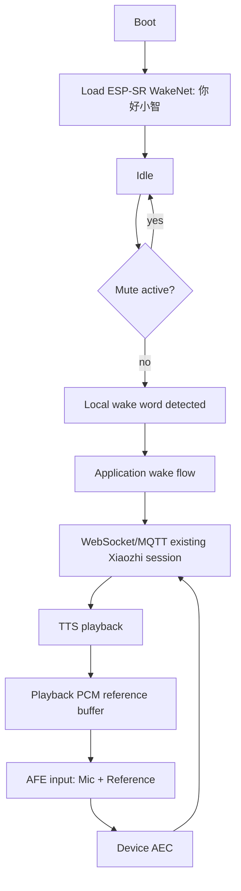

# 006 Spec：Voice PE 本地唤醒词与 AEC

## 目标

让 `home-assistant-voice-pe` 支持本地说“你好小智”唤醒，并在设备端启用基于真实 playback reference 的 AEC。006 不做自定义唤醒词、不做 XMOS DFU、不改小智协议。

## 代码证据

| 文件/来源 | 证据 |
|---|---|
| `main/boards/home-assistant-voice-pe/config.json` | 当前显式配置 `CONFIG_WAKE_WORD_DISABLED=y`，006 需要改为启用本地唤醒词。 |
| `managed_components/espressif__esp-sr/model/wakenet_model/*/_MODEL_INFO_` | 仓库已包含“你好小智” WakeNet 模型。 |
| `managed_components/espressif__esp-sr/Kconfig.projbuild` | 存在 `CONFIG_SR_WN_WN9_NIHAOXIAOZHI_TTS` 和 `CONFIG_SR_WN_WN9S_NIHAOXIAOZHI`。 |
| `main/Kconfig.projbuild` | ESP32-S3 + PSRAM 默认支持 `CONFIG_USE_AFE_WAKE_WORD`。 |
| `main/audio/wake_words/afe_wake_word.cc` | AFE wake word 会枚举模型并通过 `wake_word_detected_callback_` 进入应用唤醒流程。 |
| `main/audio/audio_service.cc` | `EnableWakeWordDetection()`、`SetModelsList()`、`PopWakeWordPacket()` 已有唤醒词数据流。 |
| `main/audio/processors/afe_audio_processor.cc` | AEC 根据 `CONFIG_USE_DEVICE_AEC` 和 `codec_->input_reference()` 建 AFE 输入格式。 |
| `main/boards/common/board.h` | 当前没有麦克风静音查询接口；006 需要新增默认 false 的 `IsMicrophoneMuted()`，由 Voice PE override。 |
| `main/boards/home-assistant-voice-pe/voice_pe_audio_codec.cc` | 当前 `input_reference_=false`、`input_channels_=1`，只输出单通道 mic，不能直接启用 AEC；官方 Voice PE 对唤醒和语音识别使用不同 XMOS 通道。 |
| `specs/004-*` | 004 固定了 16 kHz mic 输入、48 kHz speaker 输出、32-bit 到 int16 转换和 24 倍主观等效输入增益。 |
| `specs/005-*` | 005 固定了 mute 是麦克风隐私开关，mute 打开时必须阻止听音入口。 |

## 总体流程

## 本地唤醒词

| 项 | 设计 |
|---|---|
| 唤醒词 | 固定“你好小智” |
| 模型来源 | ESP-SR 预置 WakeNet，不训练自定义模型 |
| 配置 | 移除 `CONFIG_WAKE_WORD_DISABLED=y`，启用 `CONFIG_USE_AFE_WAKE_WORD=y` 和 `CONFIG_SR_WN_WN9_NIHAOXIAOZHI_TTS=y` |
| 唤醒数据 | 保持 `CONFIG_SEND_WAKE_WORD_DATA=y`，复用现有唤醒词音频发送路径 |
| 应用入口 | 复用 `Application::HandleWakeWordDetectedEvent()` 和 `ContinueWakeWordInvoke()` |
| mute 互斥 | 新增 `Board::IsMicrophoneMuted()` 默认 false，Voice PE 返回物理 mute 状态；`Application::HandleWakeWordDetectedEvent()` 进入唤醒流程前必须检查，muted 时关闭 wake detection 并直接返回 |
| mute 检测任务 | Voice PE mute 打开时在主任务停止 wake word detection；mute 关闭且设备处于 idle/speaking 时恢复 wake word detection；Application 门禁作为最终保护 |
| 自定义词 | 不启用 `CONFIG_USE_CUSTOM_WAKE_WORD`，不使用 `CONFIG_CUSTOM_WAKE_WORD` |
| 误唤醒处理 | 第一版不做阈值调参；硬件测试若出现每小时超过 3 次误唤醒，记录模型、状态和环境噪声，暂停并评估配置 |

## AEC reference 设计

| 项 | 设计 |
|---|---|
| AFE 输入格式 | `M,R`，第 1 路是 mic，第 2 路是 playback reference |
| mic 来源 | 当前 wake word、voice processing 和 audio testing 都使用 XMOS channel 1 / NS，避免 channel 0 / AGC 进一步放大噪声；但 004 阶段已存在主观背景噪声，006 不能把噪声问题只归因于通道选择。必须同时记录 raw mic RMS 和 AFE output RMS，再决定是否单独调整输入增益或 AFE/AEC 配置 |
| reference 来源 | `VoicePeAudioCodec::Write()` 收到、即将播放到扬声器的 mono PCM |
| reference 采样率 | 必须转换到 16 kHz int16，和 mic 输入一致 |
| 重采样方式 | 使用 `esp_ae_rate_cvt_open/process`，与 `AudioService` 现有输入/输出重采样器保持同一组件；不能用简单丢点/重复点代替 |
| 缓冲容量 | 初始 reference ring buffer 为 3200 samples，即 200ms @ 16 kHz；容量必须至少覆盖两个 AFE feed chunk，溢出时丢最旧数据并记录一次限频日志 |
| 对齐策略 | `Write()` 将 48 kHz 播放 PCM 重采样后按 FIFO 写入 reference buffer；`Read()` 每次读取 mic 后，直接取 FIFO 中最早的 reference 帧，不额外增加播放延迟；不足补 0 并计数，超量保留最近 200ms。这个策略对齐官方小智软件 reference 实现：播放写入后立即进入 reference buffer，不能先人为增加 100ms 延迟。超过 300ms 没有新播放 PCM 时，清空旧 reference，避免下一段播放开头拿到上一句尾音 |
| 格式切换 | 只有 `input_reference_=true` 且 `input_channels_=2` 时，`Read()` 才输出 interleaved `mic,reference`；否则保持 004/005 的单通道 mic 输出 |
| 空 reference | 仅允许在没有播放时为 0；播放期间 reference RMS 必须非零 |
| 音量关系 | reference 必须反映实际播放 PCM；旋钮音量变化后 reference RMS 应随播放幅度变化 |
| 线程 | `Read()` 与 `Write()` 共享 reference buffer，必须用同一把音频数据锁或专用 mutex 保护 |
| 播放尾音 | 从 speaking 回到 listening 前，必须等待 decode/playback queue 为空、当前 playback chunk 写完，并在 `input_reference()` 设备上保留 700ms 尾音保护窗；TTS stop 事件必须先 drain playback，再切 listening/idle；即使状态已到 listening，迟到的 TTS 音频包仍必须进入播放队列，不能被丢弃 |
| TTS start 队列保护 | 因为服务器 TTS 音频包可能先于 `tts start` JSON 到达，进入 `speaking` 状态时不能清空 decode/playback queue；否则会截断开头或后半句 |
| 启用收音队列保护 | `EnableVoiceProcessing(true)` 不能隐式清空 decode/playback queue；清播放队列只能出现在明确的新会话入口或停止路径，否则会清掉 listening 状态刚接收的迟到 TTS 音频 |
| speaking 上行策略 | Voice PE 在 `speaking` 阶段不运行服务器上传链路；TTS 播放收尾后、切回 `listening` 前，必须重置本地 voice processor/AFe 缓冲，并清理上行 encode queue 和 send queue 中的残留语音帧。当前阶段默认 `auto` 收音模式，只保留本地唤醒词或中心按钮打断。自由边播边听必须等 reference 延迟实测或硬件回采证明可靠后再启用 |
| listening 上传门禁 | `listening` 状态下只要 decode/playback queue 非空、当前 playback chunk 仍在播放，或 `input_reference()` 设备仍处于 700ms 播放尾音保护窗内，就不得上传麦克风音频；避免 UI 已显示聆听但本机仍在播放或刚播完时把残留音频发给服务器 |
| 实时上行反压 | AFE fetch 线程不能被 Opus 上行队列阻塞。编码队列满时丢弃过期上行帧并保留最新帧，避免 AFE `FEED` ringbuffer 爆满 |
| 服务器收音重臂 | 普通板卡遵循官方小智 realtime 连续流语义：只有新开收音窗口、播放提示音入口或本地 voice processor 未运行时才发送 `listen/start` 并启动 voice processor；Voice PE 当前使用 `auto` 模式，避免 speaking 阶段连续上行造成重复 ASR |
| PSRAM | Task 0 和硬件启动日志必须记录 free PSRAM；WakeNet + AFE + reference buffer 后 PSRAM 异常下降时暂停 |

## AEC 启用条件

| 条件 | 要求 |
|---|---|
| codec 标志 | `input_reference_=true`，`input_channels_=2` |
| AFE 配置 | `CONFIG_USE_AUDIO_PROCESSOR=y`，`CONFIG_USE_DEVICE_AEC=y` |
| 输入格式日志 | 启动或首次初始化时打印 AFE input format 为 `MR` |
| reference 诊断 | 播放期间打印 reference RMS，证明不是全零 |
| 输出诊断 | 播放期间限频打印 output peak/RMS/volume；播放时电流声必须先用 peak 判断是否数字削波，再决定是否调整 AIC3204 数字音量或模拟驱动增益 |
| 硬件验证 | TTS 或测试音播放时对设备说话，回声不应明显进入小智识别 |
| 辅助验收 | 纯播放且无人说话 30 秒内，小智 Server 不应返回用户 ASR 文本；同时记录 AFE 输出 RMS 作为 AEC 前后对比 |
| 噪声诊断 | listening 安静测试必须同时记录 `raw_rms` 和 `out_rms`；如果两者都高，优先处理原始输入增益/硬件噪声；如果 raw 低但 out 高，优先处理 AFE/AEC 配置 |

只有以上条件都满足，006 才能宣称 AEC 完成。否则必须暂停并更新 Spec，不能只提交配置开关。

## 错误处理

| 错误 | 行为 |
|---|---|
| WakeNet 模型未加载 | 启动日志报错，本地唤醒验收失败 |
| “你好小智”模型缺失 | 不切到其他唤醒词，暂停并更新 Spec |
| reference resampler 创建失败 | AEC 初始化失败，不能启用假 reference |
| 播放期间 reference RMS 为 0 | AEC 验收失败，暂停排查 |
| AFE 输入格式不是 `MR` | AEC 验收失败 |
| mute 打开仍能唤醒 | 验收失败，必须修复 |
| 误唤醒超过阈值 | 记录日志并暂停放行，评估 WakeNet 配置 |

## 验证策略

| 层 | 验证 |
|---|---|
| 静态检查 | 检查 Voice PE config 启用 `CONFIG_USE_AFE_WAKE_WORD`、`CONFIG_SR_WN_WN9_NIHAOXIAOZHI_TTS`、`CONFIG_USE_DEVICE_AEC`，且未启用 custom wake word |
| 单元/静态测试 | 扩展 `tests/test_home_assistant_voice_pe_static.py` 或新增 006 静态测试 |
| 构建 | `idf.py -DBOARD_NAME=home-assistant-voice-pe -DBOARD_TYPE=home-assistant-voice-pe build` |
| 唤醒硬件 | idle 说“你好小智”进入 listening 并完成小智回复 |
| mute 硬件 | mute 打开后说“你好小智”不进入 listening |
| AEC 诊断 | 播放期间 reference RMS 非零，无播放时 reference RMS 接近零 |
| AEC 主观验收 | 播报/测试音期间说话，明显减少设备自播声音被识别的问题 |
| AEC 辅助指标 | 纯播放无人说话 30 秒内不产生用户 ASR 文本；记录 AFE 输出 RMS |
| 回归 | 004 一次问答、005 LED/mute/旋钮通过 |

## 需求追踪

| 需求 | Spec 章节 | 实施任务 | 验证 |
|---|---|---|---|
| REQ-1 | 本地唤醒词 | Task 1 | AC-1/AC-2 |
| REQ-2 | 本地唤醒词 | Task 1 | static/config |
| REQ-3 | 本地唤醒词 | Task 1/7 | static/config |
| REQ-4 | 本地唤醒词 | Task 2 | AC-2 |
| REQ-5 | 本地唤醒词 | Task 2/7 | review |
| REQ-6 | 本地唤醒词 | Task 2 | AC-3 |
| REQ-7 | AEC reference 设计 | Task 3/4 | AC-5 |
| REQ-8 | AEC reference 设计 | Task 3 | review |
| REQ-9 | AEC 启用条件 | Task 4 | log/static |
| REQ-10 | AEC 启用条件 | Task 4/5 | AC-5 |
| REQ-11 | 错误处理 | Task 5/7 | review |
| REQ-12 | AEC reference 设计 | Task 7 | drift check |
| REQ-13 | 验证策略 | Task 6 | AC-4 |
| REQ-14 | 验证策略 | Task 6 | AC-8 |
| REQ-15 | 非目标 | Task 7 | drift check |
| REQ-16 | 本地唤醒词 | Task 2/6 | 误唤醒观察 |
