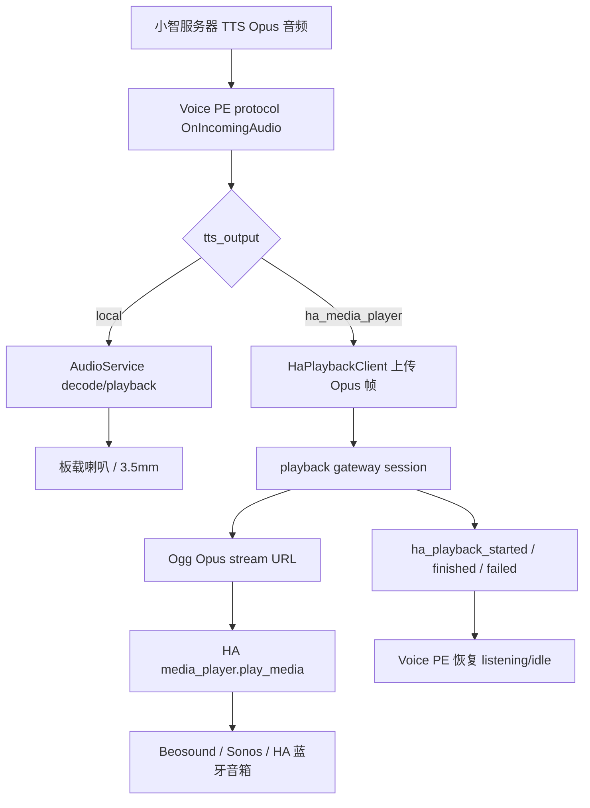

# 007 Spec：Voice PE HA media_player 播放输出

## 目标

为 Voice PE 增加第三种 TTS 播放输出：`ha_media_player`。该模式保留小智服务器下发的 TTS 音频和音色，把播放交给 gateway 和 Home Assistant 的指定 `media_player`。

007 不把回复文本交给 HA 重新 TTS，不默认转码 MP3/AAC，不实现 HA 外放时自由抢话，不改变 006 的 XU316 前端 DSP 分工。

## 代码证据

| 文件/来源 | 证据 |
|---|---|
| `main/application.cc` | 当前 `protocol_->OnIncomingAudio()` 直接把小智 TTS 音频包推入 `audio_service_.PushPacketToDecodeQueue()`，本机播放由 ESP32 decode/playback queue 决定。 |
| `main/application.cc` | 当前 `tts start/stop/sentence_start` 状态机已维护 `current_tts_text_`、decode packet count、playback drain 和 listening 恢复。007 必须改这里的输出路由和 HA 播放等待逻辑。 |
| `main/audio/audio_service.cc` | 当前本机播放队列、decode idle guard、playback tail guard 都是本地喇叭路径。HA 外放不能只依赖这些本地队列判断播放完成。 |
| `main/gateway_url.h` | 当前已有运行时 gateway URL 读取逻辑，优先 NVS `wifi.wake_arb_url`，空值回退 `CONFIG_WAKE_ARBITRATION_GATEWAY_URL`。007 第一版复用该 gateway。 |
| `main/wake_arbiter_client.cc` | 当前设备已有向 gateway 发 HTTP 请求的客户端模式和 `Device-Id`、`Client-Id` header 约定。 |
| `main/announcement_audio_client.cc` | 当前已有 gateway 生成音频帧再让 Voice PE 本地播放的反向链路；007 是把小智 TTS 音频从 Voice PE 推到 gateway 播放。 |
| `main/home_assistant_manager.cc` | 当前 HA MQTT 只暴露设备实体、状态、assistant 文本和 Announcement 文本；没有直接调用 HA `media_player` 服务的能力。 |
| `specs/006-*` | Voice PE 的 XU316/AEC 边界已固定：本机输出时 XU316 才有机会拿到播放参考。HA 外部音箱播放不能按本机 reference 路径处理自由抢话。 |
| `docs/plans/2026-04-26-xiaozhi-gateway.md` | gateway 是独立服务，端口 8125，已有 wake arbitration/room context 定位。007 应扩展 gateway，而不是让 ESP32 直接连 HA。 |

## 总体架构



## 输出模式

| 模式 | 行为 |
|---|---|
| `local` | 完全走现有本机 decode/playback queue，支持板载喇叭和 3.5mm。 |
| `ha_media_player` | TTS 音频不进入本地 decode/playback queue，改为流式上传 gateway，由 HA `media_player` 播放。 |

第一版不做 `both`。如果需要同时本机和 HA 播放，必须另开 feature，因为同步、回声和状态恢复复杂度会明显上升。

## 配置模型

建议新增 NVS namespace：`ha_playback`。

| Key | 类型 | 默认 | 说明 |
|---|---|---|---|
| `tts_output` | string | `local` | `local` 或 `ha_media_player`。 |
| `media_player_entity_id` | string | 空 | HA 目标实体，例如 `media_player.beosound2`。 |
| `timeout_ms` | int | `60000` | 等待 HA 播放结束的最大时间。 |
| `restore_listening` | bool | `true` | 播放结束后按当前 listening mode 恢复 listening/idle。 |
| `barge_in_mode` | string | `wake_word_only` | 第一版固定为 `wake_word_only`，配置值只允许该值。 |
| `stream_format` | string | `ogg_opus` | 第一版固定为 `ogg_opus`。 |
| `initial_buffer_ms` | int | `500` | gateway 开始对外出流前的初始缓冲，允许 300..1000。 |
| `local_volume_when_ha_output` | int | `0` | 只用于防止 HA 外放期间的提示音或异常本机输出混音；同段小智 TTS 在 `ha_media_player` 模式下不得进入本机 decode/playback queue。若实现证明 HA 外放期间没有任何本机音频输出路径，该配置可保持内部固定值，不必暴露给用户。 |

gateway URL 第一版复用 `gateway_url::GetWakeArbitrationGatewayUrl()`。如果后续新增独立 `ha_playback_gateway_url`，优先级必须是：独立 NVS 值 > 当前 gateway URL > sdkconfig 默认。

gateway 侧必须配置 `public_stream_base_url`。这是 HA 和目标播放器实际访问 `stream.ogg` 的外部地址，不能默认使用 gateway 进程看到的 `127.0.0.1`、容器内地址或仅 ESP32 可访问的地址。

## 配网页

| 项 | 设计 |
|---|---|
| 文件 | `local_components/esp-wifi-connect/assets/wifi_configuration.html` |
| 后端 | `local_components/esp-wifi-connect/wifi_configuration_ap.cc` |
| API | 复用 `/advanced/config` 和 `/advanced/submit` |
| UI | 在高级配置中新增 “HA playback” 小节，复用现有表单样式 |
| 校验 | `tts_output=ha_media_player` 时 `media_player_entity_id` 必填，`timeout_ms` 必须 10000..120000 |
| 非目标 | 不查询 HA 实体列表，不做播放器下拉搜索 |

## Voice PE 固件设计

| 组件 | 设计 |
|---|---|
| `HaPlaybackSettings` | 新增小型 settings wrapper，读取 `ha_playback` NVS。 |
| `HaPlaybackClient` | 新增 gateway 客户端，负责创建播放 session、上传 Opus 帧、接收状态事件、取消 session。 |
| `Application` | 在 `tts start` 时根据输出模式选择本地播放或 HA 播放。 |
| `OnIncomingAudio` | `local` 模式推入 `AudioService`；`ha_media_player` 模式推给 `HaPlaybackClient`，不进本地 decode queue。 |
| `tts stop` | `local` 模式保持现有 drain；`ha_media_player` 模式发送 end-of-stream，等待 gateway `finished/failed/timeout`。 |
| local volume | 同段 TTS 不靠调低本机音量实现静音，而是根本不进入本地播放队列；只有为了防止提示音或异常本机输出混音时，才临时设置 `local_volume_when_ha_output`，并在结束、失败、取消时恢复。 |
| 状态恢复 | 只在 gateway 完成事件或超时后恢复 listening/idle，不能只看到小智 `tts stop` 就恢复。 |
| Opus 边界 | Voice PE 必须在上传 gateway 前完成小智协议层解密/解包；gateway 收到的是裸 Opus packet payload，不负责 MQTT/WebSocket 解密。 |

## Gateway 协议

第一版使用 HTTP 创建 session + WebSocket 上传/回调，避免 ESP32 直接管理 HA 鉴权和播放器协议。

| Endpoint | 方法 | 说明 |
|---|---|---|
| `/playback/sessions` | POST | Voice PE 创建 HA 播放 session。 |
| `/playback/sessions/{session_id}/upload` | WebSocket | Voice PE 上传 TTS Opus 帧，同时接收 gateway 状态事件。 |
| `/playback/sessions/{session_id}/stream.ogg` | GET | HA/播放器拉取 Ogg Opus 流。 |
| `/playback/sessions/{session_id}` | DELETE | Voice PE 或 gateway 取消播放。 |

### 创建 session 请求

```json
{
  "device_id": "aa:bb:cc:dd:ee:ff",
  "client_id": "voice-pe",
  "media_player_entity_id": "media_player.beosound2",
  "stream_format": "ogg_opus",
  "sample_rate": 16000,
  "frame_duration_ms": 60,
  "initial_buffer_ms": 500,
  "timeout_ms": 60000,
  "replace_existing": true
}
```

### 创建 session 响应

```json
{
  "session_id": "uuid",
  "upload_url": "ws://gateway:8125/playback/sessions/uuid/upload",
  "stream_url": "http://gateway:8125/playback/sessions/uuid/stream.ogg"
}
```

`stream_url` 必须是 HA 和目标播放器可访问的 URL。gateway 如果部署在 Docker/NAS 后面，必须配置外部可访问 base URL，不能返回 `127.0.0.1` 给 HA。

### WebSocket 上传消息

| 方向 | 类型 | 内容 |
|---|---|---|
| Voice PE -> gateway | JSON `start` | session metadata，重复发送必须幂等。 |
| Voice PE -> gateway | binary | 单个已解密的小智 Opus packet payload，保持包边界。 |
| Voice PE -> gateway | JSON `end` | 小智 `tts stop` 后发送，表示不会再有帧。 |
| Voice PE -> gateway | JSON `cancel` | 用户唤醒词/按钮打断或设备错误。 |
| gateway -> Voice PE | JSON `ha_playback_started` | HA 已调用 play_media，且播放器已经开始拉取 stream URL。 |
| gateway -> Voice PE | JSON `ha_playback_finished` | 输入流结束，播放器正常完成或 gateway 判断播放完成。 |
| gateway -> Voice PE | JSON `ha_playback_failed` | HA 调用失败、播放器不拉流、流中断、格式不支持或超时。 |

同一 `device_id + client_id` 第一版只允许一个非终态 playback session。新 session 创建时必须取消旧 session，并向旧 WebSocket 发送 `ha_playback_failed`，reason 为 `superseded`；不同设备的 session 可并行。

## Ogg Opus 封装

| 项 | 设计 |
|---|---|
| 输入 | 小智协议下发的 Opus packet payload，保持每包边界和 frame duration。 |
| 输出 | Ogg Opus stream，MIME `audio/ogg; codecs=opus`。 |
| 编码 | 不解码、不转 MP3/AAC，只做 Ogg container 封装。 |
| 时间戳 | Ogg Opus granule position 必须按 48kHz 时间基累加；例如 60ms 帧增加 2880 samples，不能按小智 packet 的 `sample_rate` 直接累加。 |
| Header | `OpusHead` 写 mono、pre-skip、input sample rate；input sample rate 只作为来源信息，播放时间基仍按 48kHz。 |
| 初始缓冲 | 默认 500ms，太低容易断流，太高会增加首字延迟；后续只能基于实测降低，例如 300ms。 |
| 兼容失败 | 如果目标播放器不支持，gateway 返回 `ha_playback_failed`，不静默降级文本 TTS。 |

如果实测发现小智 Opus packet 不能直接封装成标准 Ogg Opus，必须暂停并更新 Spec。不能先偷偷引入转码作为后处理补丁。

## Gateway 播放状态机

| 状态 | 进入条件 | 退出条件 |
|---|---|---|
| `created` | session 创建成功 | WebSocket 连接或超时 |
| `buffering` | 收到第一批 Opus 帧 | 初始缓冲达到阈值 |
| `starting` | 已生成 stream URL 并调用 HA `play_media` | 播放器开始拉流或 HA 调用失败 |
| `playing` | 播放器请求 `stream.ogg` 并持续读取 | 输入结束且输出读完、客户端断开、超时 |
| `finished` | 正常结束 | 终态 |
| `failed` | HA 调用失败、播放器不拉流、格式不支持、断流、超时 | 终态 |
| `cancelled` | Voice PE 打断或主动取消 | 终态 |

`ha_playback_started` 的判定必须基于播放器首次成功读取 `stream.ogg` 的 body 数据，不能只用 HA REST API 返回成功、HTTP HEAD 或只建立连接来冒充。

## 延迟观测

| 时间点 | 记录方 | 说明 |
|---|---|---|
| `tts_start_at` | Voice PE | 收到小智 `tts start`。 |
| `first_frame_at` | Voice PE/gateway | 收到第一帧裸 Opus payload。 |
| `session_created_at` | gateway | playback session 创建完成。 |
| `buffer_ready_at` | gateway | 初始缓冲达到阈值。 |
| `ha_play_media_called_at` | gateway | 调用 HA `media_player.play_media`。 |
| `first_stream_body_read_at` | gateway | 播放器首次成功读取 `stream.ogg` body。 |
| `finished_or_failed_at` | gateway | 播放结束或失败。 |

如果首字延迟超过 3 秒，必须先用这些时间点定位是 Voice PE 上传、gateway 缓冲、HA REST、播放器拉流还是网络访问问题，不能直接调大超时掩盖。

## HA 集成

gateway 负责持有 HA URL 和 long-lived access token，ESP32 不直接接触 HA token。

| 项 | 设计 |
|---|---|
| 服务 | `media_player.play_media` |
| 参数 | `entity_id` = 配置的 `media_player_entity_id` |
| media_content_id | gateway 返回的 `stream_url` |
| media_content_type | `music` 或 `audio/ogg`，实测后固定 |
| 播放结束 | 优先通过 HA 状态/播放器拉流结束判断；HA 状态不可用时用流结束 + 超时保护 |

## HA 外放期间监听和打断

| 场景 | 行为 |
|---|---|
| HA 正在播放 | Voice PE 处于 speaking，但不上传 ASR 音频。 |
| 用户自由说话 | 第一版不支持自由抢话，不上传到小智。 |
| 本地唤醒词触发 | 取消 HA 播放，调用现有打断流程，再进入新一轮小智交互。 |
| 中心按钮触发 | 同本地唤醒词，取消 HA 播放并打断 speaking。 |
| HA 播放结束 | 按 `restore_listening` 和当前 listening mode 恢复 listening/idle。 |

原因：HA 外部音箱播放时，XU316 无法拿到该音箱的播放 reference，AEC 不可靠。第一版必须把 HA 输出视为“外放不可回采”。

## 错误处理

| 错误 | 行为 |
|---|---|
| gateway URL 为空 | `ha_media_player` 模式启动失败，记录错误，恢复 idle/listening。 |
| `media_player_entity_id` 为空 | 配置无效，不进入 HA 播放。 |
| 创建 session 失败 | 不本地兜底播放，记录失败并恢复状态。 |
| WebSocket 断开 | 取消 HA 播放，恢复状态。 |
| HA 调用失败 | gateway 发送 `ha_playback_failed`，Voice PE 恢复状态。 |
| 播放器不拉流 | gateway 超时失败，Voice PE 恢复状态。 |
| 播放超时 | gateway 和 Voice PE 都要有超时保护，不能卡住 speaking。 |
| Ogg Opus 不支持 | 明确失败，不改走 HA 文本 TTS。 |

## 验证策略

| 层 | 验证 |
|---|---|
| 静态测试 | 检查 `ha_media_player` 模式不会调用 `audio_service_.PushPacketToDecodeQueue()` 播 TTS。 |
| 配置测试 | 检查 NVS settings wrapper、web config backend 和 HTML 字段。 |
| gateway 单测 | session 创建、Ogg Opus stream、状态机、HA 调用失败、播放器不拉流超时。 |
| 集成测试 | 用本地 fake HA 记录 `media_player.play_media` 请求，用 HTTP client 拉 `stream.ogg`。 |
| 固件构建 | `python scripts/release.py home-assistant-voice-pe` 或确认 sdkconfig 后 `idf.py build`。 |
| 硬件测试 | Voice PE 配置 HA 输出，Beosound/Sonos/可用 HA 播放器发声。 |
| 打断测试 | HA 播放期间按钮/唤醒词能取消并进入新会话。 |
| 回归 | `local` 输出模式保持现有本机播放、3.5mm、006 唤醒和 XU316 分工。 |

## 需求追踪

| 需求 | Spec 章节 | 实施任务 | 验证 |
|---|---|---|---|
| REQ-1..REQ-2 | 输出模式 | Task 1/3 | AC-1/AC-10 |
| REQ-3..REQ-5 | Ogg Opus 封装 | Task 4/5 | AC-3/AC-9 |
| REQ-6..REQ-8 | Gateway 协议 | Task 3/4/6 | AC-2/AC-4 |
| REQ-9..REQ-11 | Gateway 播放状态机 | Task 5/7 | AC-4/AC-5 |
| REQ-12..REQ-15 | HA 外放期间监听和打断 | Task 7 | AC-6/AC-7 |
| REQ-16..REQ-19 | 配置模型/配网页 | Task 1/2 | 静态检查/手工配置 |
| REQ-20 | 错误处理 | Task 5/7 | AC-8 |
| REQ-21 | 输出模式/回归 | Task 8 | AC-10 |
| REQ-22..REQ-23 | 目标/非目标 | Task 9 | drift check |
| REQ-24 | 延迟观测 | Task 5/8 | AC-11 |
